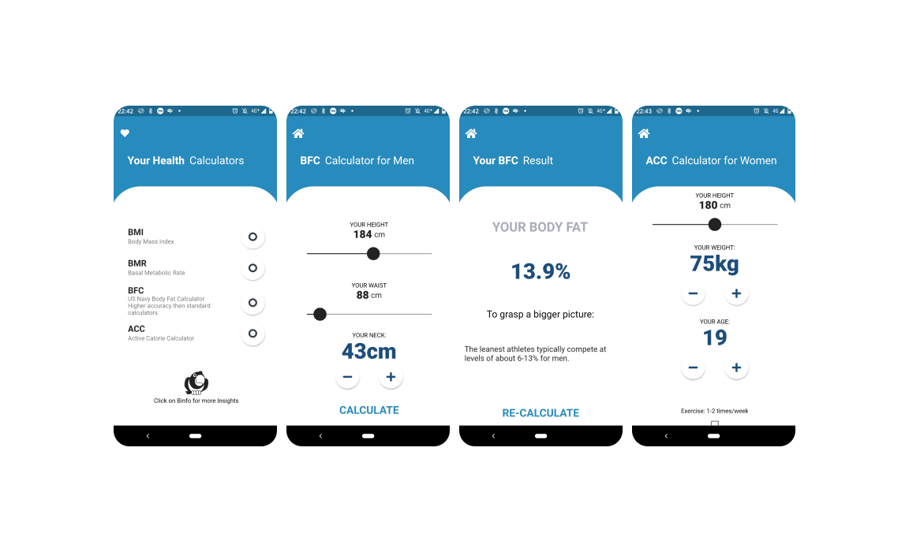

# Health Calculator App

### This App allows the user to calculate several indexes:
- BMI
- BMR
- BFC (US Navy Formula)
- ACC (Us Navy Formula

#### Tools
###### Android Studio (Flutter Extension)
###### Hyper-V Shell for Windows (git commits)
###### Programming Language: Dart

### Short description:
I have split the app into three sub-directories.
  1. components (includes a custom design for buttons, sliders, etc. as well as the constants which are applied on each screen and input screen)
  2. input_screens (only consist of the adjustable function which requires user input)
  3. screens (only display the final result of the selected HealthCalculator
  
I created these sub-directories to accomplish a clean structure for myself and a more readable selection.

### Before I started to code:
I scratched the general design
implemented my key input options for the user
### Short intro to the Clean Code and Refactoring approaches:
#### 1. The design template
The code for the template is stored in the "main.dart" field using elegance patterns by simplifying the application structure and the readability of the code, without causing several duplications of the template file for each screen.

#### 2. The components:
##### I have created this directory as the source of import. The reason behind that is to have a clear import structure for all of my input_screens and screens.
Each constant follows the same design flow 
I created the "constants.dart" file to store all my variables. These are applied for the basic functions and UI of the App.
all input fields for the UI are stored here. Such as buttons, sliders, and icons. 

#### 3. The input_screens
##### To not cause confusion every input_screen follows the same rules for readability. Such as calling the bool ex1, ex2, ex3 variable from the method in the specific calculation process for men and women.
The calculation starts if the user presses the BottomoButton 'CALCULATE'. 

#### 4. The calculate functions
each identifier is described to easily understand the shortcut names
the functions are small and return each value
a clear declaration of the identifiers

### Side Note:
For the ACC (Active Caloric Need) Calculator exists three different factors. This depends on exercising frequency.
#### Excercises per week: (for both genders)
1-2x = 1.2

2-3x = 1.4

3-5x = 1.75

# Future Features:
##### - Micro and Macro Nutrition Value Chart
##### - Profile for users
##### - ThoughtLeaders who can share their road to success for their specific health goals
##### - BirdInfo becomes the ChatBot for general questions regarding health and goal settings
